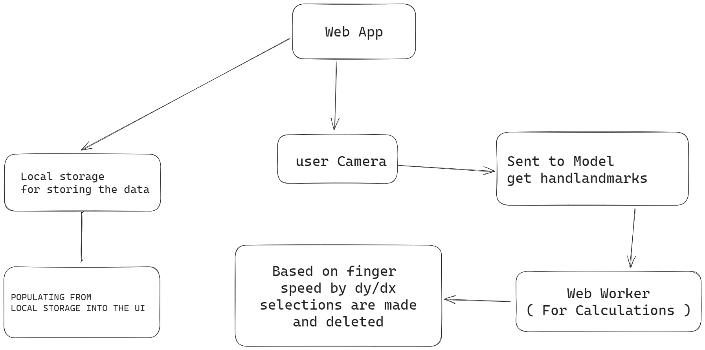

## Vyavastha - Control the whole app by just using your hands like a magic wand

## Manage, Track, and Analyze Your Expenses with a Wave of Your Hand!

### Watch the demo video here by clicking the link

### Description

Manage, Track, and Analyze Your Expenses with a Wave of Your Hand!  

Vyavastha is an innovative expense tracker app that brings convenience and accessibility to a whole new level. With this magical app, you can effortlessly add, edit, and track your expenses, all while immersing yourself in a world of enchantment. 

Features 
🚀 Gesture Control: No trackers, no touchscreens – just your bare hands! Vyavastha allows you to control the app using simple, intuitive gestures. Say goodbye to cumbersome interfaces and experience the future of interaction. 

📊 Visualize Your Financial Journey: Gain deep insights into your spending habits with Vyavastha's powerful graphing capabilities. Effortlessly visualize your financial journey, understand patterns, and make informed decisions to take control of your financial destiny. 

🌈 Inclusivity and Accessibility: Vyavastha is designed with inclusivity in mind. The app leverages cutting-edge gesture technology, ensuring that people with mobility issues or disabilities can effortlessly control and benefit from its features. 

🔒 Data Security: We understand the importance of your data. Vyavastha stores your information securely on our servers, providing a reliable backup and ensuring there's never a loss of data. Rest easy, knowing that your financial details are safeguarded with the utmost care. 

### Architecture of this Vyavastha

### Parts in which github copilot helped

Apart from UI, github copilot helps me develope features faster for common tasks such as getting 
the elements in a list and checking which is the selected index  

Switch back to zero index if we are the end of the list  

And sometimes it even predicts what I am trying to do and automatically completes the whole function
if the function name is relevant such as updateSelectedIndex(); with industry level code by adding validations and error checking, that was really amazing 🎉  

